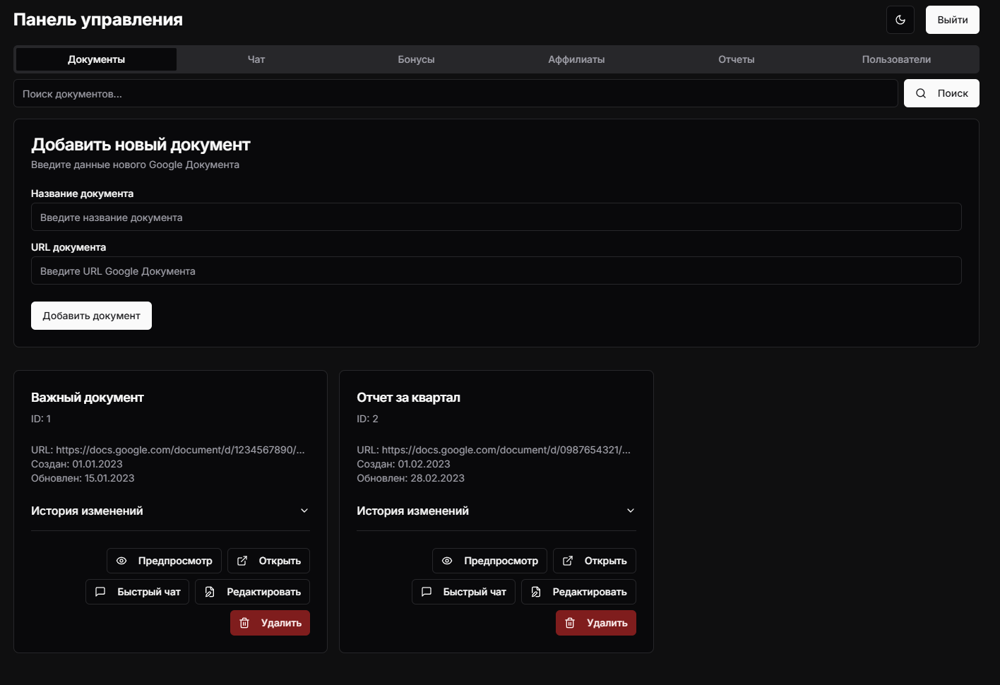
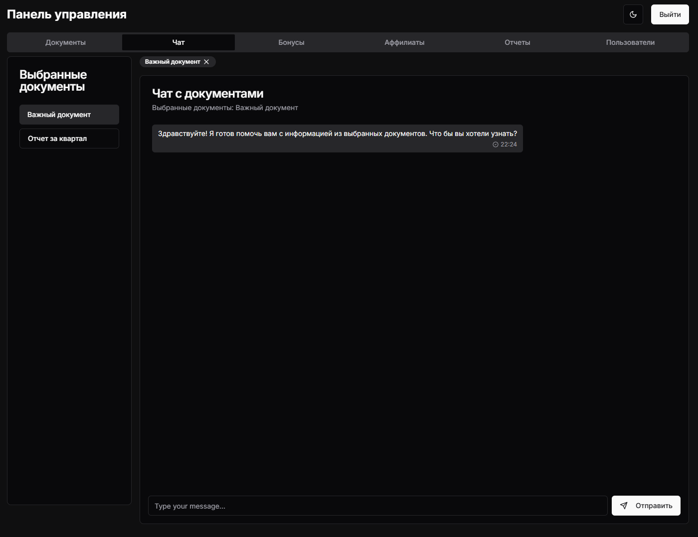
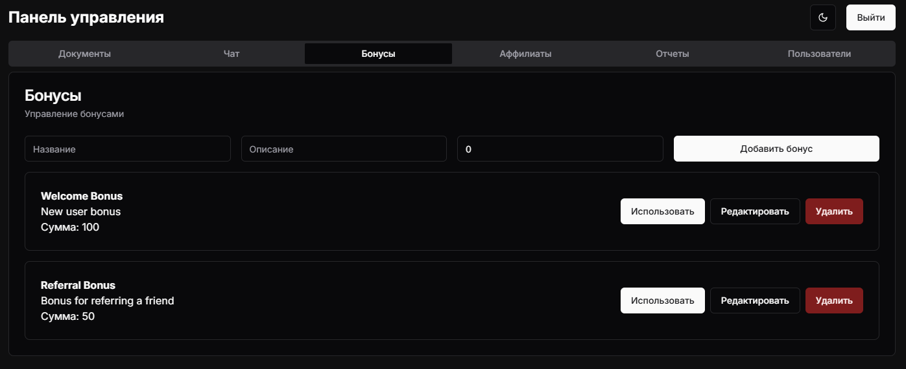
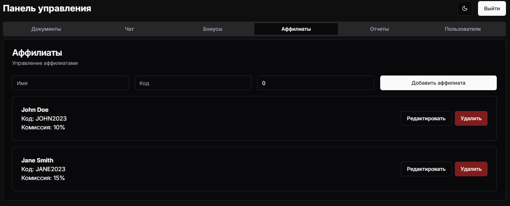
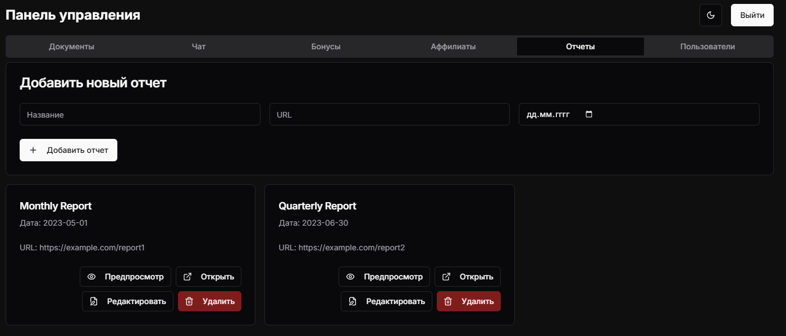
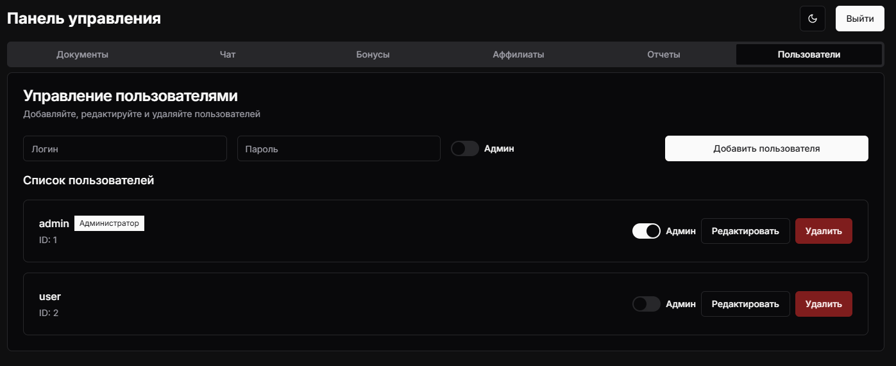
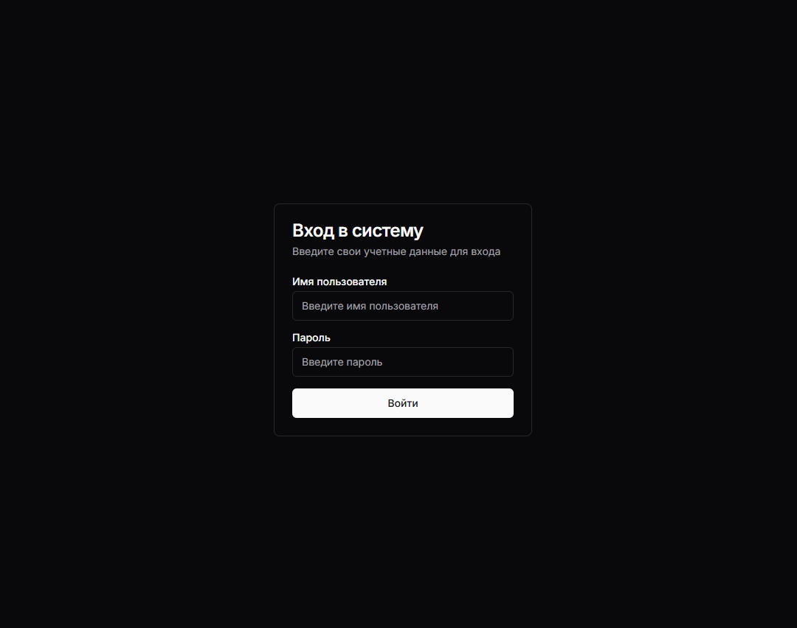

# DocumentChat

A modern document management application with integrated chat functionality that allows users to interact with their documents intelligently.



## Features

- **Document Management**: Upload, organize, and manage documents with ease
- **Intelligent Chat**: Chat with your documents using AI-powered interactions
- **User Management**: Control user access and permissions
- **Reports & Analytics**: Generate insights from your document data
- **Bonus System**: Reward users with a comprehensive bonus system
- **Affiliate Program**: Track referrals and manage affiliate relationships
- **Responsive Design**: Works seamlessly across desktop and mobile devices
- **Dark/Light Mode**: Choose your preferred theme for better viewing experience

## Screenshots

### Login Page



### Document Management



### Chat Interface



### Reports Dashboard



### User Management



### Settings



## Tech Stack

- **Frontend**: Next.js 14, React 18, TypeScript
- **UI Components**: Radix UI, Shadcn UI
- **Styling**: Tailwind CSS
- **State Management**: Zustand
- **Form Handling**: React Hook Form, Zod validation
- **Data Visualization**: Recharts
- **Date Management**: date-fns
- **Animations**: Tailwind CSS Animations

## Getting Started

### Prerequisites

- Node.js 18.0 or later
- npm or yarn package manager

### Installation

1. Clone the repository:

   ```bash
   git clone https://github.com/yourusername/document-chat.git
   cd document-chat
   ```

2. Install dependencies:

   ```bash
   npm install
   # or
   yarn install
   ```

3. Run the development server:

   ```bash
   npm run dev
   # or
   yarn dev
   ```

4. Open [http://localhost:3000](http://localhost:3000) in your browser to see the application.

## Environment Variables

Create a `.env.local` file in the root directory with the following variables:

```
# API Keys (replace with your actual keys)
NEXT_PUBLIC_API_URL=your_api_url_here

# Authentication (if applicable)
NEXT_PUBLIC_AUTH_DOMAIN=your_auth_domain
NEXT_PUBLIC_AUTH_CLIENT_ID=your_client_id

# Add other environment variables as needed
```

## Project Structure

```
document-chat/
├── app/                # Next.js app directory
│   ├── api/            # API routes
│   ├── dashboard/      # Dashboard pages
│   ├── settings/       # Settings pages
│   └── page.tsx        # Home page
├── components/         # React components
│   ├── ui/             # UI components
│   └── ...             # Feature components
├── hooks/              # Custom React hooks
├── lib/                # Utility functions and stores
├── public/             # Static assets
├── styles/             # Global styles
└── types/              # TypeScript type definitions
```

## Usage

1. **Login**: Use your credentials to log in
2. **Documents**: Upload and manage your documents from the dashboard
3. **Chat**: Select documents and start chatting with them
4. **Reports**: Generate and view analytical reports
5. **User Management**: Manage user accounts and permissions
6. **Settings**: Configure application settings

## Deployment

This application can be deployed to any hosting platform that supports Next.js applications, such as:

- Vercel
- Netlify
- AWS Amplify
- Digital Ocean App Platform

Follow the deployment instructions for your chosen platform.

## Contributing

1. Fork the repository
2. Create your feature branch (`git checkout -b feature/amazing-feature`)
3. Commit your changes (`git commit -m 'Add some amazing feature'`)
4. Push to the branch (`git push origin feature/amazing-feature`)
5. Open a Pull Request

## License

This project is licensed under the MIT License - see the LICENSE file for details.

## Acknowledgements

- [Next.js](https://nextjs.org/)
- [React](https://reactjs.org/)
- [Tailwind CSS](https://tailwindcss.com/)
- [Radix UI](https://www.radix-ui.com/)
- [Zustand](https://github.com/pmndrs/zustand)
- [React Hook Form](https://react-hook-form.com/)
