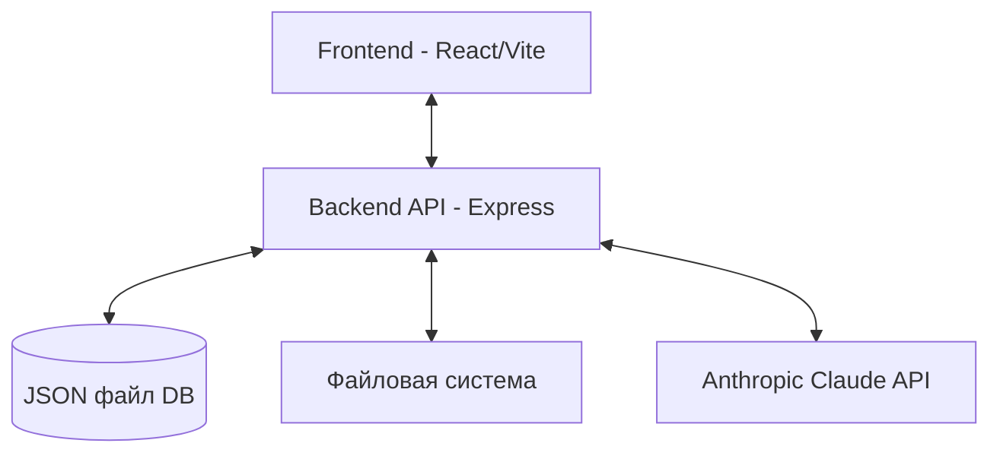

# Системные шаблоны (systemPatterns.md)

_Этот документ описывает архитектуру системы, ключевые технические решения и используемые паттерны проектирования._

## 1. Обзор архитектуры

Проект DocumentChat использует классическую клиент-серверную архитектуру, разделенную на frontend и backend части.

- **Frontend**: React приложение, созданное с помощью Vite
- **Backend**: Express сервер на Node.js/TypeScript
- **Хранение данных**: JSON файл (database.json)
- **Файловая система**: для хранения загруженных документов (директория /temp)
- **AI**: Интеграция с Anthropic Claude API для анализа документов

## 2. Ключевые технические решения

- **Монорепозиторий**: Frontend и Backend размещены в одном репозитории для упрощения разработки
- **Типизация**: TypeScript используется как на frontend, так и на backend для обеспечения типобезопасности
- **JSON-хранилище**: Вместо полноценной БД используется JSON-файл для упрощения развертывания
- **API-first подход**: Backend предоставляет четко определенный REST API
- **Компонентный подход**: UI построен из переиспользуемых компонентов

## 3. Паттерны проектирования

- **MVC на backend**: Контроллеры (controllers) обрабатывают запросы, сервисы (services) содержат бизнес-логику
- **React Hooks**: Использование хуков для управления состоянием и побочными эффектами на frontend
- **Контекст**: ToastContext для системы уведомлений
- **Zustand**: Store для глобального состояния приложения на frontend
- **Repository**: Паттерн для доступа к данным в JSON-файле

## 4. Взаимодействие компонентов

### Frontend-Backend взаимодействие
- REST API через fetch запросы, обернутые в обобщенную функцию fetchApi
- Обмен данными в формате JSON

### Внутреннее взаимодействие на frontend
- Компоненты взаимодействуют через props и контексты
- Глобальное состояние управляется через Zustand
- Роутинг через React Router с защищенными маршрутами

### Внутреннее взаимодействие на backend
- Express роуты перенаправляют запросы к соответствующим контроллерам
- Контроллеры вызывают сервисы для выполнения бизнес-логики
- Сервисы взаимодействуют с файловой системой и внешними API

_Этот документ поможет мне понять, как устроена система изнутри._
